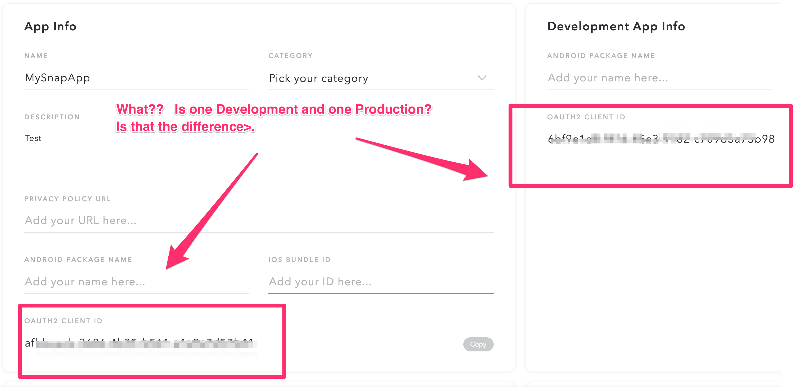
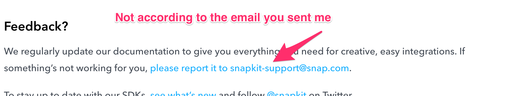
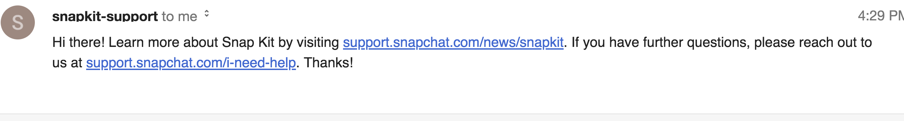
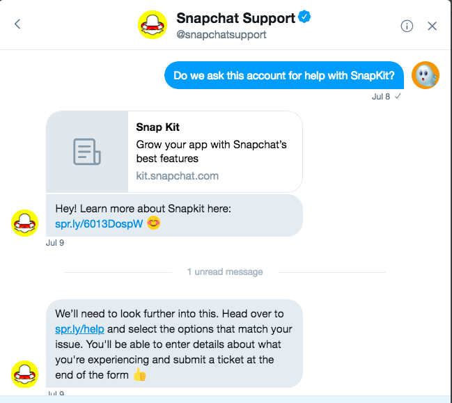
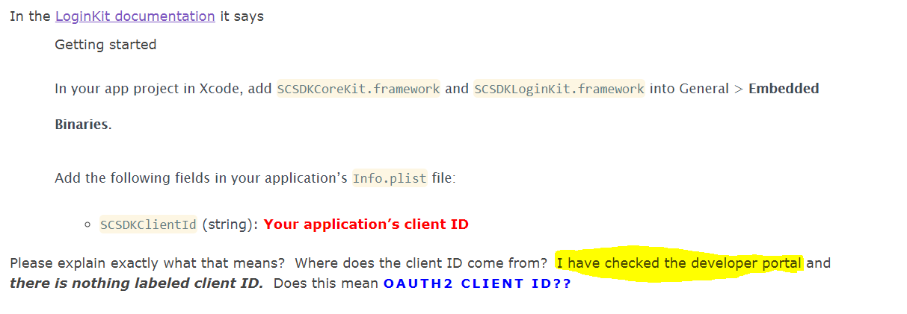

# Contents
- [Purpose](#purpose)
- [Snapkit](#snapkit)
  - [LoginKit](#loginkit)
- [Snapkit Support](#snapkitsupport)
   - [Open Issues](#openissues)
- [iOS Centric](#ioscentric)
- [Contributing](#contributing)


## Purpose
Snapchat’s Snapkit is new and there are holes in the documentation. As developers implement Snapkit, they will develop best practices. This document exists to help developers obtain success with Snapkit and document the best practices they come across.

There will be copy/paste form the [Snapkit documentation](https://docs.snapchat.com/docs/). The purpose of which is to make it easy to see what is there as well as what should be there

## Snapkit
### LoginKit
#### Getting Started

In your app project in Xcode, add SCSDKCoreKit.framework and SCSDKLoginKit.framework into General > Embedded Binaries.

>Add the following fields in your application’s Info.plist file:
>SCSDKClientId (string): Your application’s client ID

*It isn’t clear what client ID means. The documentation immediately before this says*

>Requirements
>Client ID from the developer portal
>iOS version 10.0+

*However, there is absolutely nothing in the developer portal with a label **client ID**. Do they mean **OAUTH CLIENT ID**? (I suspect so, but have an email out to them asking about this)
And here's the ever helpful Developer Portal itself which makes things clear as mud*



>Add the following fields in your application’s Info.plist file:
>SCSDKRedirectUrl (string): The URL that will handle and complete login requests; must be a valid URL in the form foo://bar — without bar, redirects will fail

*Translating the above into English/code, if you registered *my-app://auth/snap* then you would have this entry in your Info.plist:*
```xml
<key>SCSDKRedirectUrl</key>
<string>my-app://auth/snap</string>
<key>CFBundleURLTypes</key>
 <array>
 <dict>
 <key>CFBundleTypeRole</key>
 <string>Editor</string>
 <key>CFBundleURLSchemes</key>
 <array>
 <string>my-app</string>
 </array>
 </dict>
 </array>
 ```
 - [See this example info.plist from Snapchat](https://github.com/Snap-Kit/bitmoji-sample/blob/master/ios/BitmojiSampleApp/Supporting%20Files/Info.plist)
- See [this bug filed](https://github.com/Snap-Kit/bitmoji-sample/issues/3)
- See [this medium post](https://medium.com/adventures-in-ios-mobile-app-development/snapchat-snapkit-developer-support-sadly-sad-89d63011c6ad)

## Snapkit Support
Snapkit Support is delivered like any other Snapchat issue at [I Need Help](https://support.snapchat.com/en-US/i-need-help)

### Open issues
Requests out to Snapchat Support are tracked in this repo's issues marked with [Pending Snap Support](https://github.com/bbookman/Snapchat-Snapkit-DIY-Docs/labels/Pending%20Snap%20Support) label

#### Don't try this, because you won't get support - Part 1
Do not do what the documentation says to do in order to get support. This is the doc:


But this is the response I got from doing exactly what it says to do:


#### Don't try this, because you won't get support - Part 2
Don't tweet to [Snapchat Support](https://twitter.com/snapchatsupport)


#### When using the official channel, I need help, do not expect them to answer what you asked


##### Response from support:
Hi there, Thanks for reaching out! If you haven't already you may want to login to the **Snap Kit developer portal** to gain access to Client ID. Before we enable an application for public use, Snap reviews all apps that integrate with Snap Kit. To submit, simply add an app in the Snap Kit developer portal once your development is complete, then click Submit for Review.

## iOS Centric
I’m working to integrate Snapkit into an existing iOS Swift project, and so I’ll be adding mostly iOS centric information. As this repository is open, anyone is welcome to add Android info.

## Contributing
Please fork and submit pull requests

## Bugs and feature requests
File bugs or requests as any other repository. Feel free to work on anything that is there.

## Contact
For most things, file bugs. anything else:
[@saganone1](http://twitter.com/saganone1) on twitter
